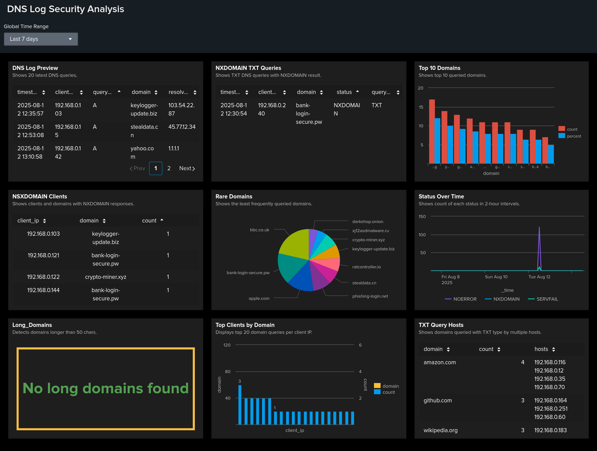

# DNS Log Security Analysis in Splunk

Analytical DNS security case: detection of misconfiguration, beaconing, DGA, and possible DNS tunneling. The project relies on nine focused SPL searches and a dashboard.

---

## Demo

**Dashboard (screenshot):** [Dashboard1.png](./Dashboard1.png)  

**Full report (DOCX):** [Splunk_DNS_Analysis_Report.docx](./Splunk_DNS_Analysis_Report.docx)  
The report has everything: step-by-step queries, screenshots, analysis, and conclusions for each step.

---

## Data

- Source: `index=main`, `sourcetype=csv`  
- Fields: `timestamp`, `client_ip`, `query_type`, `domain`, `resolved_ip`, `status`

---

## Performed Checks and Conclusions

1) **Baseline sample (first 20 events)**  
*Purpose:* validate parsing and data structure.  
*Finding:* fields parse correctly; some empty `resolved_ip` and rare `query_type`.  
*Recommendation:* align fields to CIM, filter noise, verify `sourcetype`.

2) **TXT queries with NXDOMAIN**  
*Purpose:* detect tunneling indicators or config errors.  
*Finding:* TXT+NXDOMAIN observed for certain domains and hosts.  
*Recommendation:* verify domain ownership and host processes; if unclear, temporarily block and monitor.

3) **Top 10 queried domains**  
*Purpose:* establish baseline and traffic concentration.  
*Finding:* mostly known CDN/SaaS; some unknown domains appear in top.  
*Recommendation:* allowlist legit domains; queue unknowns for review and monitoring.

4) **Rare domains**  
*Purpose:* surface low-frequency targets (possible DGA/C2).  
*Finding:* single hits to several domains.  
*Recommendation:* WHOIS, passive DNS, VirusTotal; if risky, block/sinkhole and escalate.

5) **High-activity `client_ip ↔ domain` pairs**  
*Purpose:* find “chatty” pairs for triage priority.  
*Finding:* several hosts generate unusually high volume to specific domains.  
*Recommendation:* validate business need and services on hosts; throttle if needed.

6) **Status trend over time (120-minute bins)**  
*Purpose:* spot spikes/anomalies in NOERROR/NXDOMAIN/SERVFAIL.  
*Finding:* NXDOMAIN/SERVFAIL peaks in specific intervals.  
*Recommendation:* correlate with change windows and incidents; alert on deviations from baseline.

7) **NXDOMAIN by host and domain**  
*Purpose:* isolate persistent problematic pairs.  
*Finding:* repeated NXDOMAIN to the same domains from specific hosts.  
*Recommendation:* check domain registration and resolver settings on hosts; block/isolate if risky.

8) **Long domains (>50 characters)**  
*Purpose:* detect possible data encapsulation in subdomains.  
*Finding:* overlong labels found (or not found).  
*Recommendation:* sample examples; enforce egress DNS length/size limits; add IDS rules.

9) **TXT queries repeated across multiple hosts**  
*Purpose:* reveal shared tooling or policy using TXT.  
*Finding:* the same TXT domain is queried by many hosts.  
*Recommendation:* validate legitimacy (SPF/ACME/corporate services); if unjustified, escalate and block.

---
## Analysis
- Established a baseline for domains and hosts, captured “tops” and “rarities.”
- Identified NXDOMAIN/SERVFAIL spikes over time and persistent host ↔ domain pairs with errors.
- Flagged potential tunneling indicators: overlong domains and repeated TXT queries across multiple hosts.
- Isolated “chatty” traffic sources and unknown domains for triage prioritization.
- Correlation with change windows confirmed some spikes as operational and others as investigation-worthy.

## Conclusion
This project delivers a reproducible DNS threat-hunting workflow in Splunk: 9 targeted searches + a dashboard provide rapid overview and clear entry points for incident response. Recommendations: maintain an allowlist for legitimate domains, alert on NXDOMAIN growth, control domain label length/entropy, and validate TXT activity. Full details and screenshots are in `Splunk_DNS_Analysis_Report.docx`.

